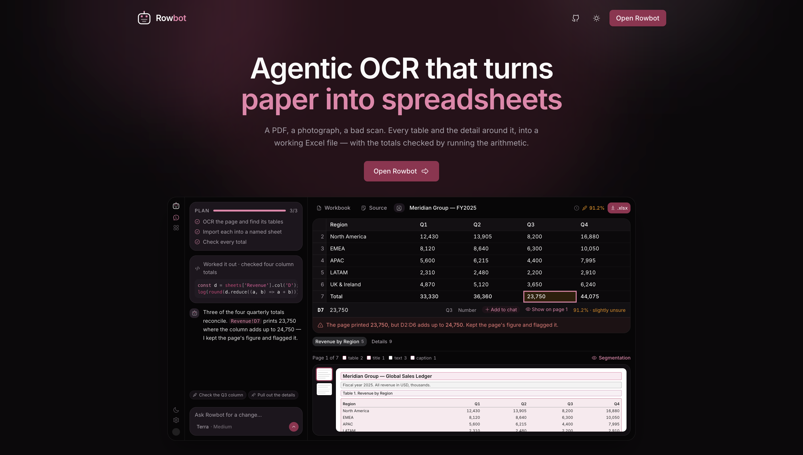
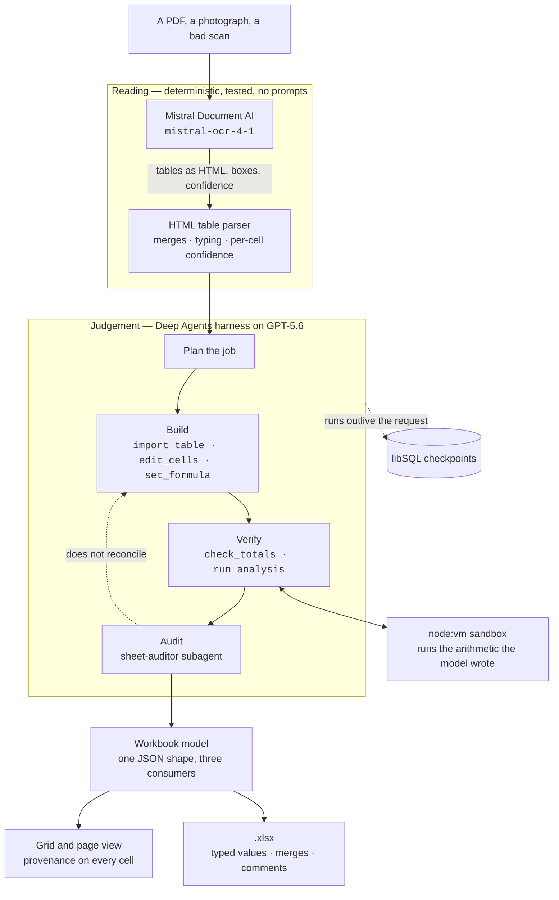
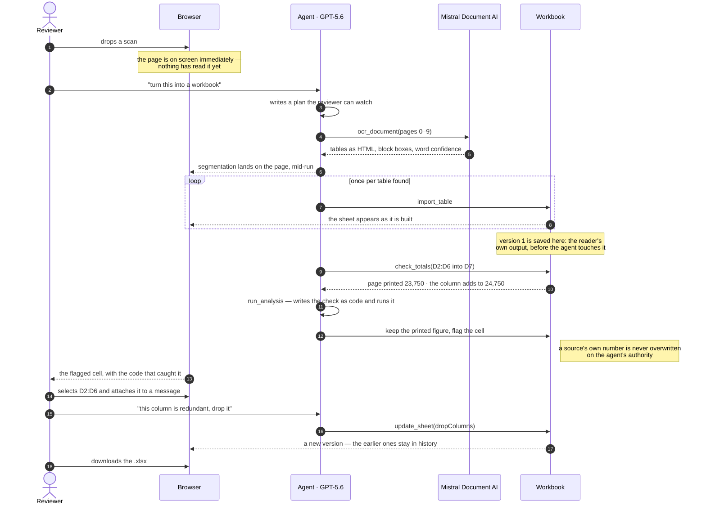

<a href="https://rowbot.sh"></a>

<p align="center">
  <a href="https://youtu.be/sFGWTywSG4c"></a>
  <a href="https://rowbot.sh"></a>
</p>

<p align="center">
  
  
  
  
  <br>
  
  
  
  <br>
  
  
  
  
</p>

# Rowbot

Turns PDFs and images of tables into multi-sheet Excel workbooks — and shows its
working, so you can check the output before you trust it.

**[Watch the walkthrough](https://youtu.be/sFGWTywSG4c)** — a tour with real
documents, including a scan it misreads and then catches itself on.

**Live at [rowbot.sh](https://rowbot.sh).** Sign-up is invite-only: it runs on my
own OpenAI and Mistral keys, and an open sign-up form is an open invoice. For a
code, message me — [Eli Aboutorabi on
LinkedIn](https://www.linkedin.com/in/elham-aboutorabi/) — and see
[Access and limits](#access-and-limits) for how the rest is enforced.

Rowbot is built around two ideas. First, reading a table is a _structural_
problem, not a text problem: [Mistral Document AI](https://docs.mistral.ai)
returns tables as HTML with `rowspan`/`colspan`, bounding boxes and per-block
confidence, which is what makes merged headers and accounting negatives
survivable. Second, deciding how a document _should_ become a workbook needs
judgement, so that part runs as a real agent — it plans, reads, builds, audits
its own output, and can be interrupted and corrected at any point.

## How it works

The split of labour is the whole design. Parsing HTML into a grid and typing
values are deterministic, so they live in tested code rather than in prompts.
The agent decides the things that actually need judgement: which tables belong
together, what a sheet should be called, where the header really ends, which
misread cells to correct, and what the reviewer needs warning about.



| Stage           | Lives in                                  |
| --------------- | ----------------------------------------- |
| OCR and parsing | `src/lib/server/ocr`, `src/lib/coerce.ts` |
| Agent and tools | `src/lib/server/agent`                    |
| Workbook model  | `src/lib/types/workbook.ts`               |
| Export          | `src/lib/server/xlsx/build.ts`            |

### A run, end to end

What that looks like from the reviewer's side — including the case Rowbot
exists for, where the page's own total does not add up.



### Design notes

- **Runs are resumable.** A custom libSQL `BaseCheckpointSaver`
  (`src/lib/server/agent/checkpointer.ts`) persists every superstep, so a run
  survives the serverless request that started it. That is what lets you close
  the tab, come back, and tell the agent to change something.
- **Workbook edits are operations, not overwrites.** The model routinely calls
  `import_table` several times in one step; a plain last-value channel would
  keep one and drop the rest. `src/lib/server/agent/workbook-ops.ts` folds ops
  through a reducer, which also gives the UI a revision history for free.
- **The reader's own output is kept as version one.** The state at the moment
  the agent first changes something is saved ahead of its work, so there is
  always an untouched version to compare a correction against.
- **Provenance is kept end to end.** Every cell remembers the text the page
  actually showed and how confident the OCR was, surfaced in the grid, the cell
  inspector and as comments in the exported file.
- **The model names the range; the code does the arithmetic.** `check_totals`
  (`src/lib/server/agent/tools/totals.ts`) asks the model only for the thing it
  is good at — which cell is a total and what it covers — and adds the column
  itself, which makes verification deterministic, free and auditable. A total
  that reconciles becomes a real Excel `SUM`. One that does not keeps the figure
  the document printed and carries a flag: Rowbot does not overwrite a source's
  own number on its own authority, and a workbook that silently disagrees with
  its source is worse than one that says so.
- **Anything that is not a column sum is written as code and run.**
  `run_analysis` (`src/lib/server/agent/tools/analyse.ts`) hands a script a
  frozen view of the workbook inside a `node:vm` context — no module loader, no
  I/O, a deadline — so a quantity times a unit price less a discount is checked
  by an interpreter rather than predicted. It is also how a figure the reader
  could not make out gets recovered from the ones around it, with the working
  kept.
- **The sheet and the conversation share a vocabulary.** A1 notation
  (`src/lib/sheet-ref.ts`) runs in both directions: the agent writes
  `[[Ledger!D2:D5]]` and it renders as something you can click, and a block you
  select with shift-arrow attaches to your next message as the same reference.
  Selecting a column and asking about it is one gesture, and the status bar
  shows its sum so you can check the agent's arithmetic yourself.
- **Spend is bounded in two places.** A public demo that calls paid APIs on
  every run needs both halves: `src/lib/server/invites.ts` bounds how many
  accounts exist, and `src/lib/server/entitlements.ts` bounds what each one may
  use. See [Access and limits](#access-and-limits).

## Access and limits

Rowbot calls OpenAI and Mistral on every run, so an open sign-up form is an
open invoice. Two independent limits, either of which is enough on its own to
make abuse pointless:

**Sign-up is invite-only.** `ROWBOT_INVITE_CODES` holds a comma-separated list
of codes; the sign-up form asks for one and the server checks it. Issue and
revoke by editing the variable. If the variable is unset or empty, **sign-up is
closed** — a missing config never opens the door. If you want to try the hosted
app, message [Eli Aboutorabi on
LinkedIn](https://www.linkedin.com/in/elham-aboutorabi/) and I will send you a
code.

**Each account has an allowance.** Everything is in
`src/lib/server/entitlements.ts`:

| Tier        | Who                                  | Documents | Pages | Agent turns |
| ----------- | ------------------------------------ | --------- | ----- | ----------- |
| `free`      | the default                          | 1         | 10    | 6           |
| `byok`      | saved their own keys in **Settings** | ∞         | 200   | ∞           |
| `unlimited` | listed in `ROWBOT_UNLIMITED_EMAILS`  | ∞         | 200   | ∞           |

The free tier is sized to show the whole product working — read a document,
watch the harness, correct it, export the workbook — and no more. Turns are
metered as well as documents, because one document with an unbounded
conversation costs exactly as much as unbounded documents.

An account that saves its own OpenAI and Mistral keys is spending its own
credit, so nothing is metered. Those keys are encrypted with AES-256-GCM under
a key derived from `BETTER_AUTH_SECRET` (`src/lib/server/secrets.ts`), are never
returned to the browser, and are held for the life of one request in an
`AsyncLocalStorage` (`src/lib/server/provider-keys.ts`) rather than the agent's
runtime context — context can reach a checkpoint, and an API key must never be
written to the database.

Hitting a limit returns `402` with a sentence explaining it and a link to
Settings, everywhere it can happen.

## Running it locally

Requires Node 22+.

```bash
npm install
cp .env.example .env      # then fill in the keys below
npm run db:push           # create the local SQLite schema
npm run dev
```

`.env` needs, at minimum:

| Variable             | Where it comes from                                         |
| -------------------- | ----------------------------------------------------------- |
| `DATABASE_URL`       | `file:local.db` for development                             |
| `ORIGIN`             | `http://localhost:5173` — must match exactly                |
| `BETTER_AUTH_SECRET` | `openssl rand -base64 32`                                   |
| `OPENAI_API_KEY`     | [platform.openai.com](https://platform.openai.com/api-keys) |
| `MISTRAL_API_KEY`    | [console.mistral.ai](https://console.mistral.ai)            |

`BLOB_READ_WRITE_TOKEN` is optional locally — without it, uploads are written to
a gitignored `.rowbot-uploads/` folder.

## Tests

```bash
npm run test:unit -- --run     # fast, offline, no API keys needed
```

The live end-to-end tests are opt-in because they spend real tokens:

```bash
ROWBOT_LIVE=1 npx vitest run --project server src/lib/server/agent/__probe__
```

They run a real PDF through Mistral and GPT-5.6 and assert on the same event
protocol the browser consumes, then check the exported `.xlsx` opens correctly.

## Deploying to Vercel

See [`docs/deploy.md`](docs/deploy.md) for the full walkthrough.

## Models

The picker exposes the GPT-5.6 family — Sol, Terra and Luna — and the full
reasoning-effort range (`none` → `max`). Effort is the lever that matters: a
clean digital PDF needs almost none, a skewed photo of a merged financial table
rewards a lot of it.

## This is my first big build, and I would like your notes

Rowbot is the first substantial application I have made. A good deal of what is
in here — the checkpointer, the workbook reducer, the way the agent and the
deterministic code divide the work — is a first attempt at a thing rather than
a settled one, and I would rather be told what is wrong with it now than find
out later.

So if you read the code and something looks naive, or over-engineered, or like
it already has a name I should have known, please say so. Bug reports are
welcome and so are architectural opinions:
[open an issue](https://github.com/eliaboutorabi/rowbot/issues), send a pull
request, or [message me on
LinkedIn](https://www.linkedin.com/in/elham-aboutorabi/). Same goes for the
product — if Rowbot gets something wrong on one of your documents, that is the
most useful thing you can send me.

---

Designed and developed by [Eli
Aboutorabi](https://www.linkedin.com/in/elham-aboutorabi/) with the help of
Claude.
